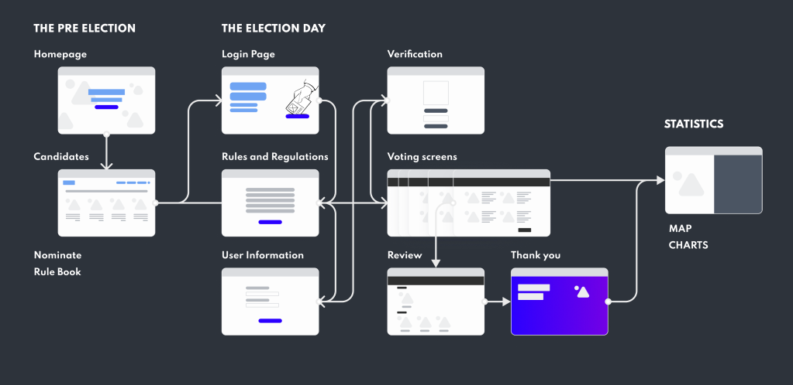

# Election Portal - 2022

This is frontend codebase for the upcoming (2022) General Elections of IIT Guwahati.

Find the figma design [here](https://www.figma.com/file/QbAGzxSbMPtlvZgi4eZLyv/Elections-Portal).

### Tools used (till now)

- React
- Redux (state management)
- Tailwind css (styling)

### Setup for dev

<code>npm install</code>
<code>npm start</code>

### Frontend flow

